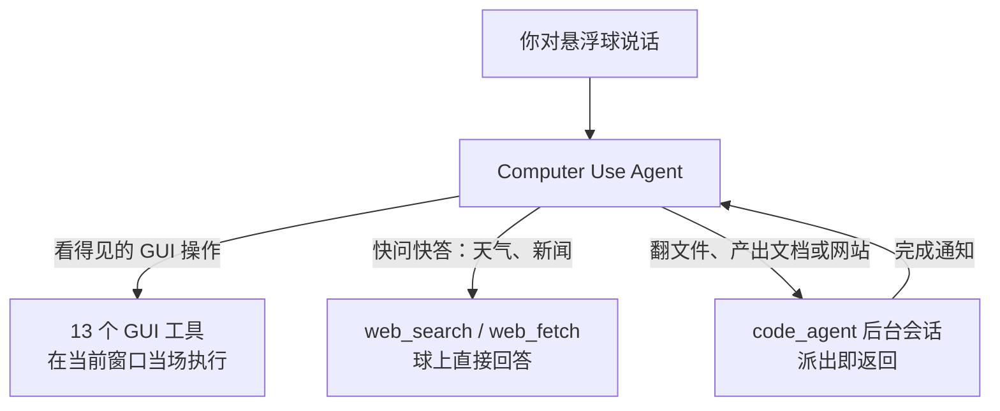

<p align="center"></p>

# dsh-orb

[English](README.md) | 中文

[DeepSeek Harness](https://github.com/deepseek-ai/deepseek-harness)（dsh）的非官方个人开发者插件。一个可安装的 bundle，为官方 dsh 桌面版和 `dsh web` 加上带 Computer Use 的悬浮球 Agent——官方仓库一行不改，主窗口仍是官方 dsh Web UI。

> **声明** — 本项目由个人开发者维护，**与 DeepSeek AI 无任何隶属、认可或合作关系**。DeepSeek 名称、Logo 与头像素材归 DeepSeek AI 所有，此处仅作为上游项目自带的默认球头像使用。

悬浮球停靠在屏幕右沿。告诉它你要什么：看得见的操作当场通过 Computer Use 执行；耗时长的复杂任务派给后台代码会话，完成后结果回到球里。主窗口保留完整的 dsh Web UI——会话管理、插件市场、模型设置——你仍然可以在里面写代码、改文件、跑命令。

不收集任何遥测数据。

## 悬浮球

启动后插件拉起自己的 helper（锁定并校验过的 Electron 运行时，独立 profile），球出现在主屏右沿，置顶。

- **悬停**展开面板，**单击**钉住，指针离开后收起。**拖动**移动球；拖出左右屏幕边缘后收成细条——再悬停即可滑回。
- **右键**打开菜单：打开主窗口、悬浮球 Agent 设置与后台 Agent 设置（两条轨各自选模型和思考强度）、坐标编码开关、「关闭悬浮球」。
- **系统托盘**常驻一个球图标：悬浮球被隐藏或主窗口关闭后，仍可从托盘唤起/隐藏球、打开主窗口或停用插件。Windows 11 默认把新托盘图标收进任务栏角溢出菜单（任务栏右下角的 ^），需要手动拖到常驻区。球跟着官方 dsh 进程走——官方应用退出，球随之退出。
- 面板里有球自己的对话历史（**历史**/**新建**）、**Access** 权限芯片（只读 / 工作区内修改 / 完全访问，默认完全访问，作用于球的命令和它派出的后台会话）、绕球折行的输入框。Agent 向你提问时，提问卡就在球上回答；helper 断开时，未回答的问题交回主窗口。
- 对话区是球内原生渲染：思考 / 正文 / 工具调用按到达顺序实时流式穿插，工具卡默认折叠、点开看参数与结果（终端、差异、读取、搜索、网页专属卡），Shiki 双主题高亮，用户与回复消息各配复制按钮，旁边显示每轮 Token 用量。
- 外观跟随主窗口：暗色 / 浅色主题与界面语言（中文 / English）镜像官方「外观」「语言」设置，支持即时切换。
- 球头像可在主窗口**设置 → 悬浮球**里挑 6 张内置动图，或换成自定义 GIF / PNG / WebP（2 MB 以内）。内置动图保持动画：球处于活动状态时照常播放，与自带头像行为一致。

## 双轨 Agent 架构

由球内的 Computer Use Agent 决定每条消息怎么处理，运行时没有独立的任务分类器：



- **前台轨 · Computer Use**：看得见的操作——打开应用、点按钮、填表单、改设置——用 GUI 工具当着你的面执行，每一步都基于前台窗口的实时截图。天气、新闻这类快问快答也留在球上，用 `web_search` / `web_fetch` 直接回答。
- **后台轨 · Code Agent**：复杂任务——翻文件、产出文档、搭网站——经 `code_agent` 派给后台标准会话。派出立即返回，球会告诉你后台在跑，你可以继续聊。后台会话结束且球空闲时，完成摘要自动回到球里，Computer Use Agent 决定下一步——继续点击、再派后台，还是收尾。

后台会话和你在主窗口手动建的会话是同一种；它出现在主窗口侧栏的 `dsh_orb` 文件夹里，可以打开、继续或停止。同一产物的后续修改回到同一个后台会话，无关的新工作另开一个。对话历史、权限、两条轨的模型设置都与官方 dsh 进程共享——球读写的就是主窗口的那份会话。

## Computer Use

球上的每条对话都带 Computer Use：第一条消息自动附上前台应用可见窗口的截图，之后每个动作都跟一张新截图（含鼠标光标），模型始终看到最新屏幕状态。

- Agent 操作期间，截图自动排除球、展开面板和观察边框，点击穿透球而不是落在球上；被观察的窗口有一圈发光的观察边框，标出 Agent 正在看哪里。非操作期间球是普通窗口，截图录屏照常包含。
- 工具列表：`click`（单击/双击/右键，支持修饰键）、`input_text`、`scroll`、`hotkey`、`long_press`、`drag`、`wait`、`long_wait`、`screenshot`（存到桌面并复制到剪贴板）、`open_in_browser`、`open_in_finder`、`list_apps`、`open_app`。
- **macOS**：第一次操作屏幕时，系统权限弹窗的授权对象是 **DeepSeek Harness**（桌面版）或你的终端（`dsh web`）——请对那个进程授权。球内的引导层会带你完成「屏幕录制」和「辅助功能」两项授权。
- **Windows**：无需系统权限引导；以管理员运行的窗口拒绝被点击和输入。
- 安装本插件即授权：GUI 工具不会逐次点击询问。

## 工作原理

```
DeepSeek Harness（官方，不改）
└─ Electron 壳（主窗口、dsh://open、单实例）
     └─ Host，以纯 Node 进程拉起（ELECTRON_RUN_AS_NODE=1）
          └─ dsh-orb 插件
               ├─ host — 会话、权限、模型、web 路由、helper 生命周期
               ├─ computer-use — 13 个 GUI 工具 + code_agent（Computer Use preset）
               └─ client-settings — 主窗口「悬浮球」设置节

Helper（自带的下载版 Electron，独立 userData）
├─ 球窗口、观察边框
└─ 数据请求 → 官方 Host 的鉴权 loopback URL
```

- 只装一个包：`dsh-orb` bundle 在构建时把 host、Computer Use 插件、helper 和设置页装配进自身。
- helper 运行时是官方原版 Electron 发布物，以 SHA-256 钉死（darwin/win32，arm64/x64），首次使用时下载并与钉死的哈希比对；运行在独立的 `userData`，与官方应用分开。
- helper 与 host 之间是只听 loopback 的 NDJSON socket，用每次启动随机生成的 32 字节 token 鉴权，只经环境变量传递——不进 argv、不落盘。带官方凭据的鉴权 URL 永远不交给 helper。
- 看门狗：socket 断开 helper 自行退出；host 最多重试 3 次。球起不来时，主窗口里的 Computer Use 仍然可用。

## 环境要求

- [DeepSeek Harness](https://github.com/deepseek-ai/deepseek-harness)：桌面版，或 CLI 的 `dsh web`。按 dsh `0.1.7-rc.2` 编译；声明的兼容范围是 `>=0.1.7-rc.2 <0.3.0-0`。
- macOS（Apple Silicon / Intel）或 Windows x64。Linux 会加载插件但不建球——后台代码会话仍可用。
- Node.js `^22.19.0 || >=24.0.0` 与 pnpm `11.7.0`（仅从源码构建时需要）。

## 安装

### 从发布版安装

插件发布到 npm registry，国内由 npmmirror 镜像分发。安装单位是 release 里的 tarball——**不是仓库本身**：把仓库链接填进插件页，装到的是 monorepo 根包，会报「这个包没有声明组合包」。

- **按名字装**——桌面版插件页里直接填 `dsh-orb`，或者：

  ```sh
  dsh plugin add dsh-orb
  ```

- **按版本号装**——`dsh-orb@<版本>`。显式版本会跳过发布年龄闸门，pnpm 从 registry 元数据写入 `integrity`。不要把 `https://registry.npmmirror.com/dsh-orb/-/dsh-orb-<版本>.tgz` 这种直链贴进插件页：官方客户端自带的 pnpm 11.7 会因为 lockfile 没有 `integrity` 拒绝远程 tarball 直链。

**刚发布的版本在 24 小时内按名字装可能仍解析到上一个版本。** 官方客户端内置的 pnpm 11 默认开启 `minimumReleaseAge`（1440 分钟）：按名字解析时会退回到"发布满 24 小时的最新版本"——这是供应链保护，不是网络问题。想立即拿到新版本：装 `dsh-orb@<版本号>`，或在 profile 的 `pnpm-workspace.yaml` 里豁免该包：

```yaml
minimumReleaseAgeExclude:
  - dsh-orb
```

已装旧版时无需重装：主窗口设置页的悬浮球卡片可检查并一键更新（更新流程会自己写入这条豁免）。

**插件内更新报 `operation-error` 怎么办？** 0.1.4 及更早的更新按钮把 npmmirror 的 tarball 直链交给官方客户端自带的 pnpm 11.7。这种直链在 lockfile 里没有 `integrity`，pnpm 会在下载前拒绝（`ERR_PNPM_MISSING_TARBALL_INTEGRITY`），界面只显示笼统的 `operation-error`。请在插件页按版本号安装 `dsh-orb@<版本>`（不要贴 tarball 直链）。装上之后，更新按钮改为按版本号安装，并先问 npmmirror。原始失败细节在 profile 的 `.plugin-manager/logs/operation-*/pnpm.log` 里。

### 从本地构建安装

```sh
pnpm install
pnpm build
pnpm --filter dsh-orb pack        # 生成 ./dsh-orb-<version>.tgz
```

然后在桌面版插件页添加这个 tarball，或者：

```sh
dsh plugin add ./dsh-orb-<version>.tgz
```

首次使用悬浮球时会下载 helper 的 Electron 运行时，之后缓存复用。

## 开发

```sh
pnpm typecheck   # 各包 tsc 检查
pnpm test        # node:test 套件 + computer-use 的 vitest 套件
pnpm build       # 构建全部包并装配 bundle
```

本插件的设计文档在 [docs/](docs/)——可行性分析、架构、分阶段实施与持续追加的修订记录。

## 状态与已知限制

- **划词工具条**（划词后搜索 / 翻译 / 发给 Agent）修复缺陷期间暂时停用；代码保留，但所有入口已撤下，偏好里强制关闭。
- 按 dsh `0.1.7-rc.2` 构建与测试；兼容范围内的新版 dsh 可能需要重新验证。
- Linux 上没有悬浮球；无显示器的环境仍可跑后台代码会话。
- macOS 权限弹窗写的是 DeepSeek Harness 或终端，不是本插件——权限归属承载 Agent 的进程，这是系统行为。

## 与 DeepSeek Harness 的关系

本仓库是在 [deepseek-ai/deepseek-harness](https://github.com/deepseek-ai/deepseek-harness) 之上构建的非官方衍生作品。dsh 是 DeepSeek 开源的 everything-is-a-plugin Agent 框架，会话、插件、工具与 Web UI 全部由它驱动。本项目不改任何上游代码——像普通第三方 dsh 插件一样安装。想深入了解：

- [docs/01-analysis.md](docs/01-analysis.md) — 可行性与产品决定
- [docs/02-architecture.md](docs/02-architecture.md) — 进程、包、通信、安全
- [packages/computer-use/README.md](packages/computer-use/README.md) — GUI 工具、坐标编码与权限细节

## 许可证

[MIT](LICENSE)。上游衍生的代码与素材在 [THIRD-PARTY-NOTICES.md](THIRD-PARTY-NOTICES.md) 中披露。
